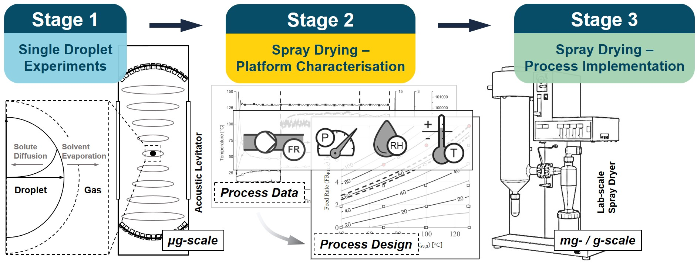

# SprayDry

<!-- Graphical Abstract -->
 

  

<!-- About The Project -->
## About The Project

This repository was created to share code for the B290 Büchi Mini-Spray Dryer data acquisition framework employed in Doerr et al (2020).

Code written by Frederik Doerr (@frederik-d), Sep-Nov 2018 (Python 2.7)  
Contact: frederik.doerr(at)strath.ac.uk / CMAC ([http://www.cmac.ac.uk/](http://www.cmac.ac.uk/))  

<!-- Reference-->
## Reference (open access):
Doerr, F., Burns, L., Lee, B., Hinds, J., Davis-Harrison, R., Frank, S., & Florence, A. (2020). *Peptide isolation via spray drying : particle formation, process design and implementation for the production of spray dried glucagon.* Pharmaceutical Research, 1–19. [https://doi.org/10.1007/s11095-020-02942-5](https://doi.org/10.1007/s11095-020-02942-5)

Data repository: [https://doi.org/10.15129/dcb859db-fe0d-4a56-b001-3f3d7ac6c44a](https://doi.org/10.15129/dcb859db-fe0d-4a56-b001-3f3d7ac6c44a)  

<!-- Files -->
## Files:
* BME680_SensorMount (folder) with BME680_SensorMount_S1 (design file for 3D printing BME680 Exhaust Gas Sensor Mount)  
* bme680_SprayDry (folder) with Arduino files for I2C serial communication. See wiring diagram in SprayDry_BME680_Fig. Additional details on Adafruit BME680 Breakout: https://www.adafruit.com/product/3660
* SprayDry_BME680_DataLogger.py: data collection from Arduino nano with connected Adafruit BME680 Breakout.
* SprayDry_RS232_DataLogger.py: data collection for B-290 Mini-Spray Dryer (Büchi Labortechnik, Switzerland)
* XS_RS232_DataLogger.py: data collection for XS60002S balance (Mettler Toledo, Switzerland, Fig. 3 P11).  

